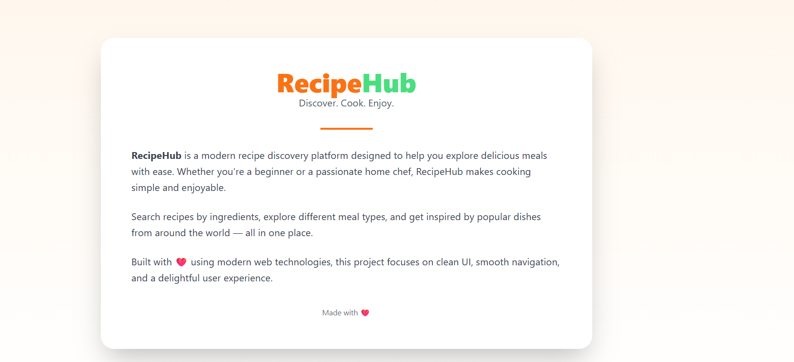
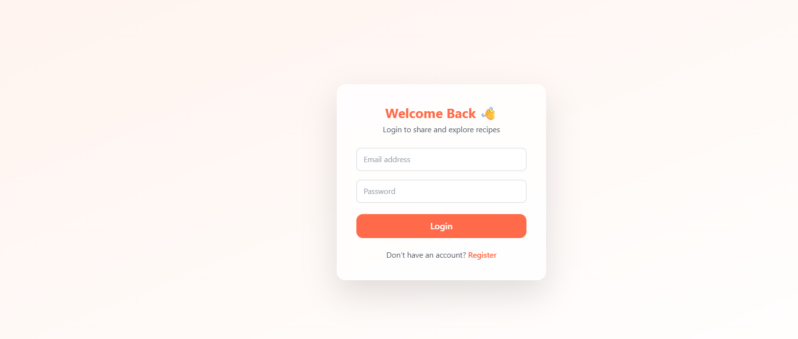
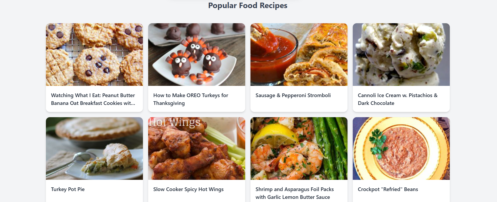
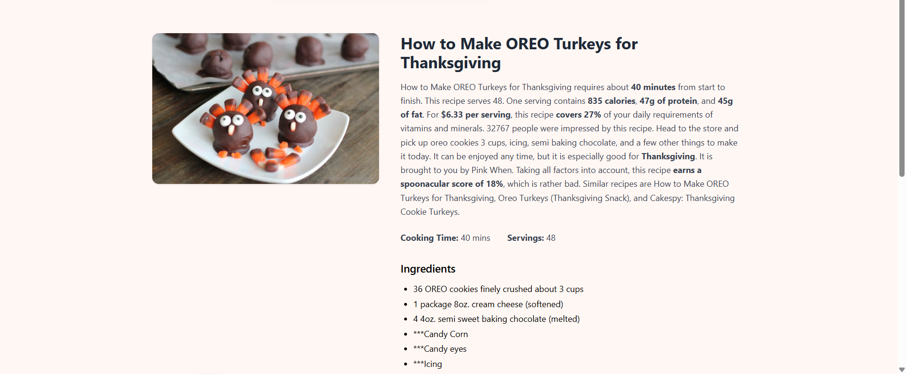
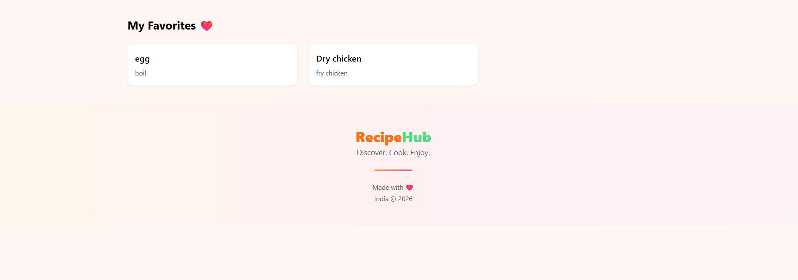
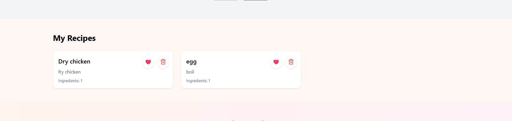
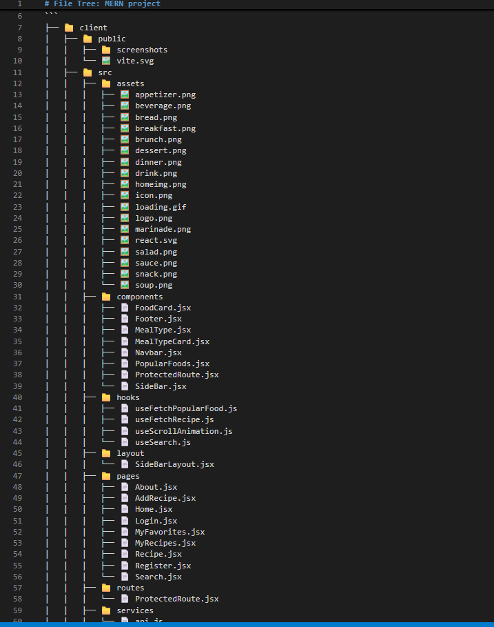
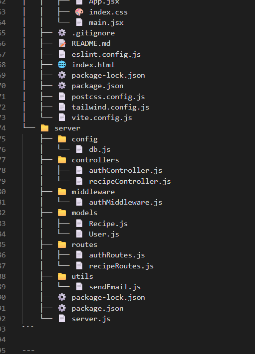

# 🍽️ RecipeHub – MERN Recipe Sharing Platform

RecipeHub is a modern **MERN-stack recipe sharing platform** designed for food lovers.  
It allows users to explore real-world recipes, create their own recipes, save favorites, and manage everything securely in one place.

---

## 📌 About the App

Users can:

- ✅ Create and upload their own recipes  
- ✅ View added recipes in **My Recipes**  
- ✅ Like / favorite any recipe  
- ✅ Delete their own recipes  
- ✅ Explore thousands of recipes via **Spoonacular API**  
- ✅ View detailed recipe instructions  
- ✅ Search recipes by keywords and meal type  
- ✅ Filter by categories (Dessert, Main Course, Salad, Appetizer, etc.)  
- ✅ Secure routes using **JWT Authentication**  
- ✅ Receive email notifications on new user registration  

✨ The platform provides a **beautiful UI**, smooth animations, and a fully responsive layout.

---

## 🖼️ Screenshots

### 🏠 Home Page

### ℹ️ About Page

### 🔐 Login & Register

### 🧭 Navigation

### 📋 Recipe List

### 📖 Recipe Details

### ❤️ Favorites

### 👨‍🍳 User Recipes (My Recipes)

### 📁 Folder structure

---

## 🛠️ Technologies Used

### Frontend (Client)
- React.js  
- Vite  
- Tailwind CSS  
- React Router v6  
- Axios  
- React Query (@tanstack/react-query)  
- React Hot Toast  
- Lucide Icons  
- Hero Icons  

### Backend (Server)
- Node.js  
- Express.js  
- MongoDB (Mongoose ORM)  
- JWT Authentication  
- bcryptjs (password hashing)  
- CORS  
- Nodemailer (email notifications)  
- dotenv (environment variables)

---

## 🌐 APIs Used

### 🔵 Spoonacular Food API
Used to fetch:
- Recipe details  
- Ingredients  
- Nutrition values  
- Cooking steps  
- Images  

---

## ⭐ Key Features

### 🔐 User Authentication
- Secure login & registration  
- Password hashing using bcrypt  
- JWT token-based authentication  
- Protected routes (Frontend + Backend)

### 🍳 Recipe Management
- Add new recipes (title, ingredients, steps, image)  
- View user-specific recipes in **My Recipes**  
- Delete own recipes  
- Displayed in clean card format  

### ❤️ Favorite / Like System
- Like & unlike recipes  
- Heart icon turns red when liked  
- Favorites saved in database  
- Favorite recipes accessible in **My Recipes**

### 🔍 Explore Recipes
- Fetch real recipes using Spoonacular API  
- Detailed cooking instructions  
- Ingredient list with quantities  
- Nutrition, cooking time & servings  
- Beautiful recipe detail page  

### 🔎 Powerful Search System
- Search recipes by keyword  
- Filter by meal type / categories  
- Pagination / load more support  

### 📧 Email Notification
- Welcome email on user registration  
- Implemented using Nodemailer + Gmail App Password  

### 🎨 UI & UX
- Fully responsive design  
- Clean modern UI with Tailwind CSS  
- Toast notifications for success/error  
- Hover animations, category icons & smooth transitions  

### 🗑️ Delete Recipe
- Users can delete only their own recipes  
- Confirmation safety  
- Instant UI update  

---

## 🚀 Project Summary

**RecipeHub** is a complete **MERN-stack application** that combines custom recipe management with a real-world recipe API.  
It allows users to **explore, create, save, and manage recipes** securely in a single, beautifully designed platform.

---

## 📌 Future Improvements (Optional)
- Recipe comments & reviews  
- User profile customization  
- Admin dashboard  
- Deployment with Docker / Cloud  

---

## 👨‍💻 Author
**Pawan**  
MERN Stack Developer  

---
